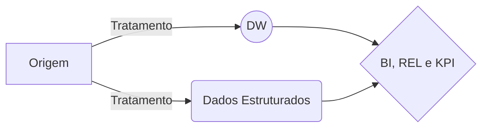

# **Projeto BV Financeira {001}:**  
>  
>**Tratamento de Dados**  
> Sistema: {2BFree - 2BCollector}  
> Inicio: {2019-10-23}  
> BV - Financeira  
>  
>> **Estrutura básica:**  
>>Aumentar a performance dos relatórios de sistema e simplificar/padronizar os dados.  
>> {ETL}->{dados estruturados}--{ETL}-->{DW organizado_limpo}=={BI--Rel--KPI}:  
>>.
>>  

>  
>>**Informações:**  
>>Replicação: Não, direto na produção  
>>Vincular/Transferir para outro BD: Não, fora do projeto  
>>Banco de Dados: PostgreSQL  {plpgsql}  
>
>>**Contato:**  
>>Marcio Ferreira Junior  
>>Cel.: 016 9 8830 8470  
>>[Perfil no LinkedIn {marciofjr}](https://www.linkedin.com/in/marciofjr/)  
>
    Nota: 
    	lembre-se, estamos direto no banco de produção,  
    		é importante o cuidado e a garantia da performance na execução dos códigos !!!
>  
## **Padrão de Criação de Tabelas:**
>  
**Padrão Estabelecido:**  
>  
    {01-ini}_{02-projeto.numeracao}_{03-tipo}_{04-tipo.numeracao}_{05-letra.origem}_{06-complemento.descricao}  
>  
**Descrição do Padrão:**  
>  
>{01-ini} = {tmp_mfj}:  
>>tmp = sigla padrão utilizada para criação de tabelas fora do sistema {equipe do sistema}  
>>mfj = temos várias tabelas {tmp} criadas pela {equipe do sistema}, {mfj} para identificar o projeto  
>  
>{02-projeto.numeracao}:  
>>01, = {no caso utilizaremos o número 01, nosso primeiro nesse banco de dados}  
>>02,  
>>03, ... de 01 até 99  
>>00 == somente para tabela global  
>  
>{03-tipo}:  
>>dp = {de-para}  
>>en = {enum enumeracao}  
>>tb = {tabela fato}  
>>id = {identificador performance}  
>>vf = {verificacao validacao}  
>>gb = {global projeto==00}  
>>ex = {execucao - ordem executar}  
>  
>{04-tipo.numeracao}: {complemento do tipo}  
>>01,  
>>02,  
>>03,  ... de 01 ate 99  
>  
>{05-letra.origem}: {sub-divisão}  
>>a,  
>>b,  
>>c,  ... de a até z  
>  
>{06-complemento.descricao}: {resumo, breve descrição}  
>>descrição ou complemento, de forma resumida do que se trata a tabela  
>>[cliente, contrato, foto_dia, telefones, carteira, parametrizados, ...]  
>  
### **Padrao {numeracao}:**  
>  
> | Flag = Status Campo {Off / On / Stand-By}:  |  
> |--|--  |  
> |0 = {Inativo}  |  
> |1 = {Ativo}|
> |2 = {Suspenso}  |  
> |type=byte  |  
>  
### **Vínculos {Referências - FK}:**  
>  
>**dp**_references:  
>>id_carteira = {tmp_mfj_01_dp_01_a_carteira}  
>>id_prod = {tmp_mfj_01_dp_02_a_produto}  
>>id_status_ctt = {tmp_mfj_01_dp_03_a_ctt_status}  
>>id_uf = {tmp_mfj_01_dp_04_a_uf_regiao}  
>>id_risco = {tmp_mfj_01_dp_05_a_fx_risco}  
>>id_atraso = {tmp_mfj_01_dp_06_a_fx_atraso}  
>>id_cod_hst = {tmp_mfj_01_dp_07_a_codigo_historico}  
>>id_idade = {tmp_mfj_01_dp_08_a_fx_idade}  
>  
>**id**_references:  
>>id_cliente = {tmp_mfj_01_id_01_a_cliente}  
>>id_contrato = {tmp_mfj_01_id_02_a_contrato}  
>  
### **Tabelas {Resumo Criadas}:**  
>  
>**gb**_Tabelas:  
>>01-A = {tmp_mfj_00_gb_01_a_calendario}  
>  
>**dp**_Tabelas:  
>>01-A = {tmp_mfj_01_dp_01_a_carteira}  
>>02-A = {tmp_mfj_01_dp_02_a_produto}  
>>03-A = {tmp_mfj_01_dp_03_a_ctt_status}  
>>04-A = {tmp_mfj_01_dp_04_a_uf_regiao}  
>>05-A = {tmp_mfj_01_dp_05_a_fx_risco}  
>>06-A = {tmp_mfj_01_dp_06_a_fx_atraso}  
>>07-A = {tmp_mfj_01_dp_07_a_codigo_historico}  
>>08-A = {tmp_mfj_01_dp_08_a_fx_idade}  
>>09-A = {tmp_mfj_01_dp_09_a_fx_entrada_fluxo}  
>>09-B = {tmp_mfj_01_dp_09_b_resumo_fx_entrada_fluxo}  
>  
>**id**_Tabelas:  
>>01-A = {tmp_mfj_01_id_01_a_cliente}  
>>02-A = {tmp_mfj_01_id_02_a_contrato}  
>>03-A = {tmp_mfj_01_id_03_a_foto_diaria}  
>>>  
>**tb**_Tabelas:  
>>01-A = {tmp_mfj_01_tb_01_a_cliente}  
>>02-A = {tmp_mfj_01_tb_02_a_contrato_basico}  
>>03-A = {tmp_mfj_01_tb_03_a_parcela_resumo_contrato}  
>>04-A = {tmp_mfj_01_tb_04_a_historico_basico}  
>>04-B = {tmp_mfj_01_tb_04_b_historico_ult_ocorr_ctt}  
>>05-A = {tmp_mfj_01_tb_05_a_boleto_basico}  
>>>  
>**ex**_Execucao:  
>>01-A = {tmp_mfj_01_ex_01_a_update_foto}  
>>>  
>**Anotacao_Analisar_depois:**  
>>... nada por hora  
>  
### **EX - Execucao {Detalhes}**  
>  
**ex**_ordem_execucao:  
>  
>01-A = {tmp_mfj_01_ex_01_a_update_foto}  
>>Atualizacao Tabela Fato e Foto {Principal Atualizacao}:  
>>>[id]_[01-A] = {tmp_mfj_01_id_01_a_cliente}  
>>>[id]_[02-A] = {tmp_mfj_01_id_02_a_contrato}  
>>>[tb]_[01-A] = {tmp_mfj_01_tb_01_a_cliente}  
>>>[tb]_[02-A] = {tmp_mfj_01_tb_02_a_contrato_basico}  
>>>[tb]_[03-A] = {tmp_mfj_01_tb_03_a_parcela_resumo_contrato}  
>>>[tb]_[04-A] = {tmp_mfj_01_tb_04_a_historico_basico}  
>>>[tb]_[04-B] = {tmp_mfj_01_tb_04_b_historico_ult_ocorr_ctt}  
>>>[tb]_[05-A] = {tmp_mfj_01_tb_05_a_boleto_basico}  
>>>[id]_[03-A] = {tmp_mfj_01_id_03_a_foto_diaria}  
>>>[tb]_[06-A] = {tmp_mfj_01_tb_06_a_foto_diaria}  
>  
>02-A = {tmp_mfj_01_ex_02_a_update_30_minutos}  
>>Atualizacao 30 minutos:  
>>>[id]_[01-A] = {tmp_mfj_01_id_01_a_cliente}  
>>>[id]_[02-A] = {tmp_mfj_01_id_02_a_contrato}  
>>>[tb]_[01-A] = {tmp_mfj_01_tb_01_a_cliente}  
>>>[tb]_[02-A] = {tmp_mfj_01_tb_02_a_contrato_basico}  
>>>[tb]_[03-A] = {tmp_mfj_01_tb_03_a_parcela_resumo_contrato}  
>>>[tb]_[04-A] = {tmp_mfj_01_tb_04_a_historico_basico}  
>>>[tb]_[04-B] = {tmp_mfj_01_tb_04_b_historico_ult_ocorr_ctt}  
>>>[tb]_[05-A] = {tmp_mfj_01_tb_05_a_boleto_basico}  
>  
### **Tabelas Globais - {Serve para qualquer Projeto}**  
>  
**gb**_global_tabela:  
>  
>01-A = {tmp_mfj_00_gb_01_a_calendario}  
>>Tabela Calendario:
>>>[dt_calend] = identificador {campo principal}  
>>>[sem_dia] = dia da semana {dom=01, seg=02, ter=03, qua=04, ... sab=07}  
>>>[sem_mes] = semana do mes {visao real da semana do mes}  
>>>[dt_du] = dia util dentro do mes {sabados=71,72,73,74,75}  
>>>[ano_n] = ano numero
>>>[mes_n] = mes numero
>>>[mes_du] = total dia util mes
>>>[sem_rel] = numero semana dentro do mes {ajustado para ter 4 semanas, regra em codigo}  
>>>[qtd_du_sem] = qts dias util considerados para == [sem_rel] {regra em codigo}  
>  
### **Tabelas De-Para {Tratamento / Padronização}:**  
>  
**dp**_tabelas:  
>  
>01-A = {tmp_mfj_01_dp_01_a_carteira}  
>>Tipo de carteira:  
>>>[id_carteira] = identificador  
>>>[cod_credor] = codigo credor {padraoBD}  
>>>[cod_entid_credor] = codigo entidade credor {padraoBD}  
>>>[carteira_nome] = carteira nome {produto cliente}  
>  
>02-A = {tmp_mfj_01_dp_02_a_produto}  
>>Produto do Contrato - Segmentacao:  
>>>[id_prod] = identificador  
>>>[desc_prod] = descricao produto  
>>>[rel_prod] = descricao produto {resumo}  
>  
>03-A = {tmp_mfj_01_dp_03_a_ctt_status}  
>>Posicao do Contrato - Status:  
>>>[id_status_ctt] = identificador  
>>>[cod_empresa] = codigo empresa {padraoBD}  
>>>[cod_credor] = codigo credor {padraoBD}  
>>>[flg_status_ctt] = flag status {0:Inativo, 1:Ativo, 2:Suspenso}  
>>>[cod_posicao_contr] = codigo posicao do contrato {padraoBD}  
>>>[nom_posicao_contr] = descricao posicao contrato {padraoBD}  
>>>[flg_bloqueia_calculo] = flag {0:Inativo, 1:Ativo}  
>>>[flg_performa] = flag {0:Inativo, 1:Ativo}  
>>>[flg_exibe_pesquisa] = flag {0:Inativo, 1:Ativo}  
>>>[flg_notifica] = flag {0:Inativo, 1:Ativo}  
>>>[flg_inibe_historico] = flag {0:Inativo, 1:Ativo}  
>>>[flg_inibe_historico_troca_pos] = flag {0:Inativo, 1:Ativo}  
>  
>04-A = {tmp_mfj_01_dp_04_a_uf_regiao}  
>>Regiao / Estado:  
>>>[id_uf] = identificador  
>>>[desc_uf] = descricao uf {nome estado}  
>>>[cod_uf] = codigo uf {sigla do estado}  
>>>[id_regiao] = identificador da regiao  
>>>[desc_regiao] = descricao regiao {nome regiao}  
>  
>05-A = {tmp_mfj_01_dp_05_a_fx_risco}  
>>Faixa de Risco:  
>>>[id_risco] = identificador  
>>>[fx_risco] = faixa de risco {divisao por faixa de valores}  
>>>[fx_risco_res] = faixa resumida de risco {Nulo, Baixo, Médio, Médio-Alto, Alto, Alto Impacto}  
>  
>06-A = {tmp_mfj_01_dp_06_a_fx_atraso}  
>>Faixa de Atraso:  
>>>[id_atraso] = identificador {01 até 1800 --- 1801==Acima de 5 anos --- 1801tbm==Sem_Atraso}  
>>>{optado por 1 = 1 --- do que resumido, por conta do cliente mudar e evita case/if}  
>>>[fx_atraso_cli_01] = faixa de atraso {visao 01 cliente}  
>>>[fx_atraso_cli_02] = faixa de atraso {visao 02 cliente}  
>>>[fx_atraso_nv01] = faixa de atraso {interna - visão 01 escritório}  
>>>[fx_atraso_nv02] = faixa de atraso {interna - visão 02 escritório}  
>>>[fx_atraso_nv03] = faixa de atraso {interna - visão 03 escritório}  
>  
>07-A = {tmp_mfj_01_dp_07_a_codigo_historico}  
>>Codigo Historico:  
>>>[id_cod_hst] = identificador  
>>>[cod_empresa] = codigo empresa {padraoBD}  
>>>[cod_credor] = codigo credor {padraoBD}  
>>>[id_perfil_cob] = parametrizado para filtro {02=supervisor/cobrador}  
>>>[cod_hist] = codigo historico {padraoBD}  
>>>[des_hist] = descricao do codigo historico  
>>>[cod_acao_cob_flt] = codigo da acao {identificador da acao}  
>>>[cod_compl] = codigo do hst para cliente {categoria + tipo + complemento}  
>>>[c01m] = acao 01 {categoria}  
>>>[c02m] = acao 02 {tipo}  
>>>[c03m] = acao 03 {complemento}  
>>>[ocor_p] = ocorrencia considerada positiva {KPI_hst}  
>>>[acio] = acionamento considerado {KPI_hst}  
>>>[alo] = alo, alguem atendeu {KPI_hst}  
>>>[cpc] = cpc, contato com a pessoa certa {KPI_hst}  
>>>[opac] = oportunidade de acordo {KPI_hst}  
>>>[ac] = proposta formalizada {KPI_hst}  
>>>[badcall] = ligacao caiu {KPI_hst}  
>>>[hang_up] = queda na transferencia de ligacao atendida (indisponibilidade de ramal) {KPI_hst}  
>>>[tel_inv] = telefone invalido {KPI_hst}  
>  
>08-A = {tmp_mfj_01_dp_08_a_fx_idade}  
>>Faixa Idade:
>>>[id_idade] = identificador {01 até 150 --- 151==Sem.Idade}  
>>>[id_fx_idade] = numeracao resumo da faixa de idade {simplificar}  
>>>[fx_idade_nv01] = faixa de idade {interna - visão 01 escritório}  
>  
>09-A = {tmp_mfj_01_dp_09_a_fx_entrada_fluxo}  
>>Faixa Estoque e Fluxo:  
>>>[id_entrada] = identificador {tempo escritorio - 01 até 999}  
>>>[ {menor ou igual 00} = id_fx_fluxo==1 --- maior que 999 id_fx_estoque==14 ]  
>>>[id_fx_fluxo] = identificador para id_fx_flux_estoq tmp_mfj_01_dp_09_b_resumo_fx_entrada_fluxo}  
>>>[id_fx_estoque] = identificador para id_fx_flux_estoq {tmp_mfj_01_dp_09_b_resumo_fx_entrada_fluxo}  
>  
>09-B = {tmp_mfj_01_dp_09_b_resumo_fx_entrada_fluxo}  
>>Resumo Faixa Estoque e Fluxo:  
>>>[id_fx_flux_estoq] = identificador {01 até 14}  
>>>[desc_fluxo_estoque] = descricao {fluxo ou estoque}  e qual faixa atuacao
>  
### **Tabelas Identificador {Id - Identificador}:**  
>  
**id**_tabelas:  
>  
>01-A = {tmp_mfj_01_id_01_a_cliente}  
>>Identificador Cliente:  
>>>[id_cliente] = identificador cliente  
>>>[cod_empresa] = codigo empresa {padraoBD}  
>>>[num_cpf_cnpj] = numero documento cliente {padraoBD}  
>  
>02-A = {tmp_mfj_01_id_02_a_contrato}  
>>Identificador Contrato:  
>>>[id_contrato] = identificador contrato  
>>>[cod_empresa] = codigo empresa {padraoBD}  
>>>[cod_credor] = codigo credor {padraoBD}  
>>>[cod_entid_credor] = codigo entidade {padraoBD}  
>>>[num_contr] = numero de contrato {padraoBD}  
>  
>03-A = {tmp_mfj_01_id_03_a_foto_diaria}  
>>Identificador Foto Diaria:  
>>>[id_foto] = identificador  
>>>[id_contrato] = identificador {origem==tmp_mfj_01_id_02_a_contrato}  
>>>[id_carteira] = identificador {origem==tmp_mfj_01_dp_01_a_carteira}  
>>>[dat_ent_contr] = identificador para alteracao {id_foto}  
>  
### **Tabelas Fato {Dados Tratados}:**  
>  
**tb**_tabelas:  
>  
>01-A = {tmp_mfj_01_tb_01_a_cliente}  
>>Tabela Cliente - FATO:  
>>>[id_cliente] = identificador {origem==tmp_mfj_01_id_01_a_cliente}  
>>>[id_uf] = identificador {origem==tmp_mfj_01_dp_04_a_uf_regiao}  
>>>[id_idade] = identificador  {origem==tmp_mfj_01_dp_08_a_fx_idade} {01 até 150 --- 151==Sem.Idade}  
>>>[cod_empresa] = codigo empresa {padraoBD}  
>>>[num_cpf_cnpj] = numero documento cliente {padraoBD}  
>>>[cod_cliente] = codigo cliente {nao funciona na pratica}  
>>>[dat_nasc] = data de nascimento  
>>>[dat_digitacao] = data de cadastro  
>>>[uf] = uf, estado do cliente  
>>>[nom_munic] = nome da cidade  
>>>[nom_cliente] = nome do cliente  
>  
>02-A = {tmp_mfj_01_tb_02_a_contrato_basico}  
>>Tabela Contrato - FATO BASICO:  
>>>[id_contrato] = identificador {origem==tmp_mfj_01_id_02_a_contrato}  
>>>[id_cliente] = identificador {origem==tmp_mfj_01_id_01_a_cliente}  
>>>[id_carteira] = identificador {origem==tmp_mfj_01_dp_01_a_carteira}  
>>>[id_status_ctt] = identificador {origem==tmp_mfj_01_dp_03_a_ctt_status}  
>>>[id_fx_flux_estoq] = identificador  {origem==tmp_mfj_01_dp_09_b_resumo_fx_entrada_fluxo}  
>>>[cod_empresa] = codigo empresa {padraoBD}  
>>>[cod_credor] = codigo credor {padraoBD}  
>>>[cod_entid_credor] = codigo entidade {padraoBD}  
>>>[num_contr] = numero de contrato {padraoBD}  
>>>[num_cpf_cnpj] = numero documento cliente {padraoBD}  
>>>[dat_ent_contr] = data entrada do contrato {importante para filtro parcela}  
>>>[per_ent_contr] = dias do contrato no escritorio {[hoje] - [dat_ent_contr]}  
>>>[cod_posicao_contr] = codigo posicao contrato  
>>>[flg_status_ctt] = flag status {0:Inativo, 1:Ativo, 2:Suspenso}  
>  
>03-A = {tmp_mfj_01_tb_03_a_parcela_resumo_contrato}  
>>Tabela Parcela - FATO:  
>>>[id_contrato] = identificador {origem==tmp_mfj_01_id_02_a_contrato}  
>>>[id_atraso] = identificador {origem==tmp_mfj_01_dp_06_a_fx_atraso}  
>>>[atraso] = atraso atual do contrato  
>>>[menor_vcto] = menor vencto {usado para calculo de atraso}  
>>>[maior_vcto] = maior vencto {pc - para conhecimento}  
>>>[maior_dt_vencido] = maior data vencida {usado para identificar vencido e a_vencer}  
>>>[ult_parc_pg] = numero da ultima parcela paga  
>>>[menor_parc] = numero da menor parcela aberta  
>>>[maior_parc] = numero da maior parcela aberta  
>>>[qtd_parc_ab] = quantidade de parcela aberta {menor_p [menos] maior_p + 1}  
>>>[menor_vlr_parc] = valor da menor parcela  
>>>[med_vlr_parc] = media do valor da parcela {caso tenha fluxo irregular - media}  
>>>[maior_vlr_parc] = valor da maior parcela  
>>>[vlr_risco_parc] = valor do risco {soma todas as parcelas abertas}  
>>>[vlr_vencido] = valor da soma das parcelas vencidas {pc - atualizacao}  
>>>[vlr_a_vencer] = valor da soma das parcelas nao vencidas  
>  
>04-A = {tmp_mfj_01_tb_04_a_historico_basico}  
>>Tabela Historico Coleta - FATO:  
>>>[id_historico] = identificador {principal}  
>>>[id_cod_hst] = identificador {origem==tmp_mfj_01_dp_07_a_codigo_historico}  
>>>[id_contrato] = identificador {origem==tmp_mfj_01_id_02_a_contrato}  
>>>[id_cliente] = identificador {origem==tmp_mfj_01_id_01_a_cliente}  
>>>[cod_empresa] = codigo empresa {padraoBD}  
>>>[cod_credor] = codigo credor {padraoBD}  
>>>[cod_entid_credor] = codigo entidade {padraoBD}  
>>>[num_contr] = numero de contrato {padraoBD}  
>>>[num_cpf_cnpj] = numero documento cliente {padraoBD}  
>>>[cod_hist] = numero documento cliente {padraoBD}  
>>>[dat_data_hist] = data da ocorrencia {padraoBD}  
>>>[cod_user] = numero documento cliente {padraoBD}  
>  
>04-B = {tmp_mfj_01_tb_04_b_historico_ult_ocorr_ctt}  
>>Tabela Historico Coleta - Ultimo Ocorrencia Contrato - FATO:  
>>>[id_historico] = identificador {principal}   -- Ultimo ID  
>>>[id_cod_hst] = identificador {origem==tmp_mfj_01_dp_07_a_codigo_historico}  
>>>[id_contrato] = identificador {origem==tmp_mfj_01_id_02_a_contrato}  
>>>[id_cliente] = identificador {origem==tmp_mfj_01_id_01_a_cliente}  
>>>[dat_data_hist] = data da ocorrencia {padraoBD}  
>>>[d_defasagem] = dias sem acionamento { [hoje] - [dat_data_hist] }  
>>>[cod_user] = codigo do usuario {padraoBD}  
>  
>05-A = {tmp_mfj_01_tb_05_a_boleto_basico}  
>>Tabela Boleto Coleta - FATO:  
>>>[id_contrato] = identificador {origem==tmp_mfj_01_id_02_a_contrato}  
>>>[id_cliente] = identificador {origem==tmp_mfj_01_id_01_a_cliente}  
>>>[cod_empresa] = codigo empresa {padraoBD}  
>>>[cod_credor] = codigo credor {padraoBD}  
>>>[cod_entid_credor] = codigo entidade {padraoBD}  
>>>[num_contr] = numero de contrato {padraoBD}  
>>>[num_cpf_cnpj] = numero documento cliente {padraoBD}  
>>>[cod_operador] = operador identificacao  
>>>[cod_controle_boleto] = {0==Aberto, 1==Cancelado, 2==Baixado Manual, 3==Baixado Lote}  
>>>[dat_emissao_boleto] = data emissao boleto  
>>>[dat_vencto_boleto] = data vencto boleto  
>>>[dat_pagamento] = data pagamento boleto  
>>>[vlr_boleto] = valor do boleto  
>>>[vlr_pago] = valor do pagamento do boleto  
>  
>06-A = {tmp_mfj_01_tb_06_a_foto_diaria}  
>>Tabela Foto Diaria - FATO:  
>>>--:::{**Key**}:::--  
>>>[dt_foto] = identificador {data==foto}  
>>>[id_foto] = identificador {origem==tmp_mfj_01_id_03_a_foto_diaria}  
>>>[dat_ent_contr] = data entrada do contrato {consta no id_foto --- repetir}  
>>>--:::{**Identificadores**}:::--  
>>>--:::{Key}:::--  
>>>[dt_foto] = identificador {data==foto}  
>>>[id_foto] = identificador {origem==tmp_mfj_01_id_03_a_foto_diaria}  
>>>[dat_ent_contr] = data entrada do contrato {consta no id_foto --- repetir}  
>>>--:::{Identificadores}:::--  
>>>[per_ent_contr] = dias do contrato no escritorio {[hoje] - [dat_ent_contr]}  
>>>[id_contrato] = identificador {origem==tmp_mfj_01_id_02_a_contrato}  
>>>[id_cliente] = identificador {origem==tmp_mfj_01_id_01_a_cliente}  
>>>[id_carteira] = identificador {origem==tmp_mfj_01_dp_01_a_carteira}  
>>>[id_status_ctt] = identificador {origem==tmp_mfj_01_dp_03_a_ctt_status}  
>>>[id_fx_flux_estoq] = identificador  {origem==tmp_mfj_01_dp_09_b_resumo_fx_entrada_fluxo}  
>>>[id_atraso] = identificador {origem==tmp_mfj_01_dp_06_a_fx_atraso}  
>>>[id_historico] = identificador {principal}   -- Ultimo ID no dia da Foto  
>>>--:::{**Parcela**}:::--  
>>>[atraso] = atraso atual do contrato {conforme menor parcela vencida - no dia foto}  
>>>[menor_vcto] = menor vencto {usado para calculo de atraso}  
>>>[maior_vcto] = maior vencto {pc - para conhecimento}  
>>>[maior_dt_vencido] = maior data vencida {usado para identificar vencido e a_vencer}  
>>>[ult_parc_pg] = numero da ultima parcela paga  
>>>[menor_parc] = numero da menor parcela aberta  
>>>[maior_parc] = numero da maior parcela aberta  
>>>[qtd_parc_ab] = quantidade de parcela aberta {menor_p [menos] maior_p + 1}  
>>>[menor_vlr_parc] = valor da menor parcela  
>>>[med_vlr_parc] = media do valor da parcela {caso tenha fluxo irregular - media}  
>>>[maior_vlr_parc] = valor da maior parcela  
>>>[vlr_risco_parc] = valor do risco {soma todas as parcelas abertas}  
>>>[vlr_vencido] = valor da soma das parcelas vencidas {pc - atualizacao}  
>>>[vlr_a_vencer] = valor da soma das parcelas nao vencidas  
>>>--:::{**Historico**}:::--  
>>>[id_cod_hst] = identificador {origem==tmp_mfj_01_dp_07_a_codigo_historico}  
>>>[dat_data_hist] = data da ultima ocorrencia {padraoBD}  
>>>[d_defasagem] = dias sem acionamento { [hoje] - [dat_data_hist] }  
>>>[cod_user] = numero documento cliente {padraoBD}  
>  
#### #end